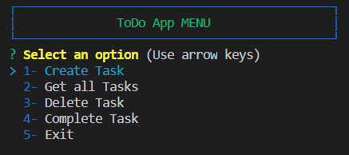
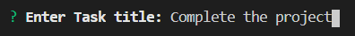
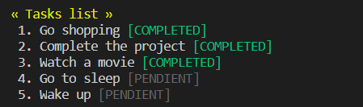
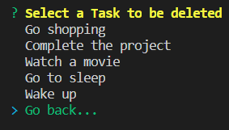
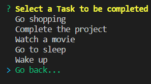

# ToDo App

>This is the repository used during the development of the 'ToDo App'.

## Table of Contents

- [Description](#description)
- [Development](#development)
- [How to use](#how-to-use)
- [Author Info](#author-info)

## Development

'ToDo App' is an application developed with NodeJS, and gives the user the option to create a List of Tasks.

[Back To The Top](#ToDo-App)

## Development

All files in this repository were developed using Node.js (v14.15.5), and the following external libraries has been used in the project:

    - inquirer (v8.0.0)
    - colors (v1.4.0)
    - uuid (v8.3.2)
    - yargs: (v16.2.0)

[Back To The Top](#ToDo-App)

## How to use

- When the app start the ToDo App MENU will show up:

- To create a new task just select the option 'Create Task', and a message will be prompted to 'Enter Task title':

- To view the Taks list select the option 'Get all Tasks':

- To delete a task select the option 'Delete Task' and you will be required to select the task that you want to delete (select 'Go back...' option to cancel):

- To change the satus of a Task to COMPLETED select the option 'Complete Task' and you will be required to select the task that you want to set status to completed (select 'Go back...' option to cancel):

## Author Info

- email: adriansanchez88@gmail.com

- LinkedIn: [adrián-sánchez-nievares-50a310159](https://www.linkedin.com/in/adri%C3%A1n-s%C3%A1nchez-nievares-50a310159/)

[Back To The Top](#ToDo-App)